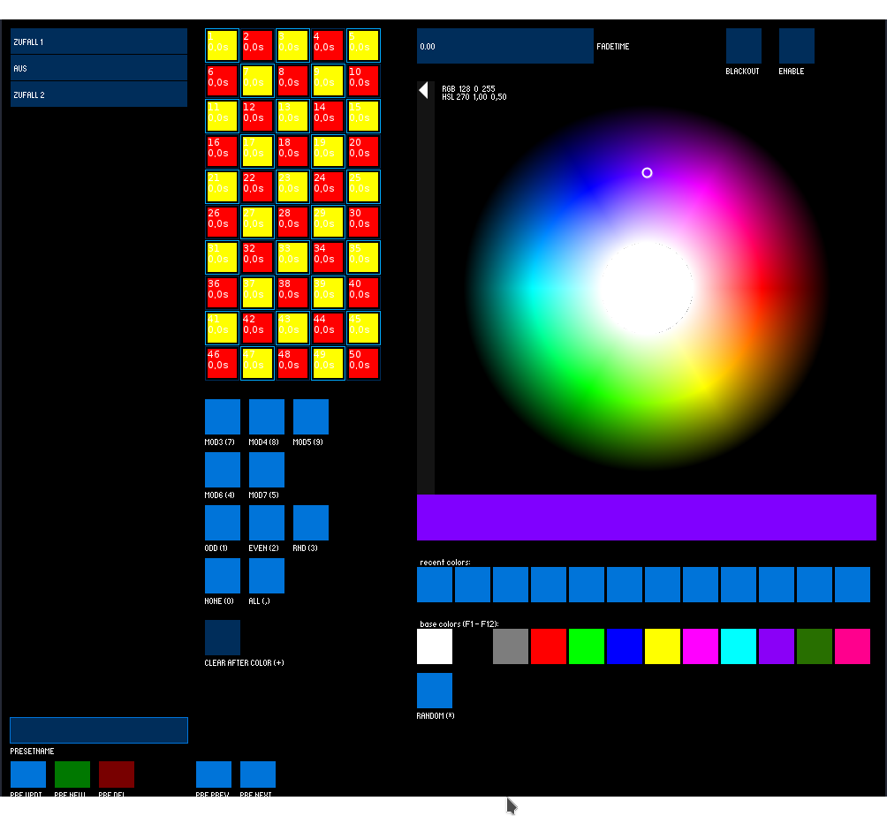
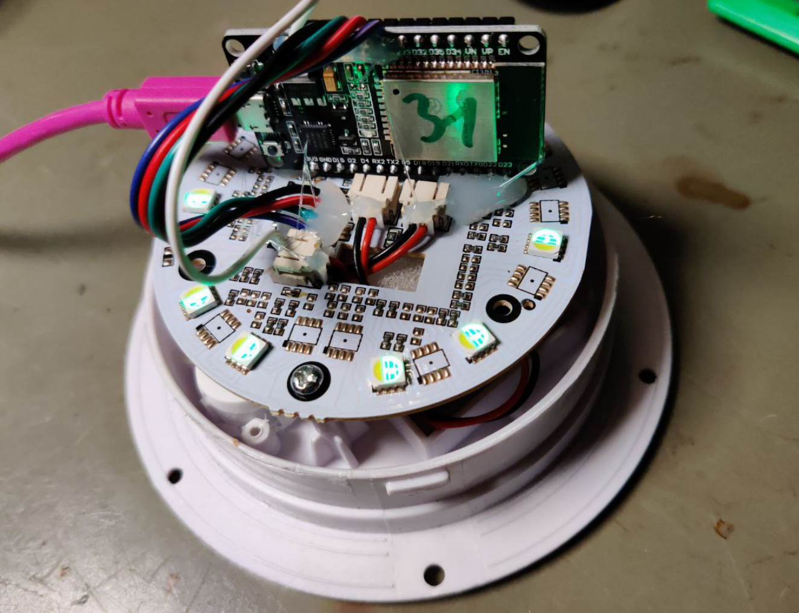

# esp32_cubes

This repository contains the software to control LED lights wirelessly via ESP-NOW.

It is using:

 * a Processing GUI for control
 * a ESP32 as USB-Serial-ESP-NOW Gateway
 * n ESP32 as ESP-NOW-to-LED controller

Please look into the subfolders for the different parts of the Project.

It was created to control 50 battery powered LED Cubes (30x30x30cm) for a
Theatre Play.

Screenshot of our rather basic controlling Software:

Here is a picture of one of our cubes:

If you are in or around the Dortmund,NRW,Germany area, you can rent the 50 Cubes. Just contact
me via Email.

